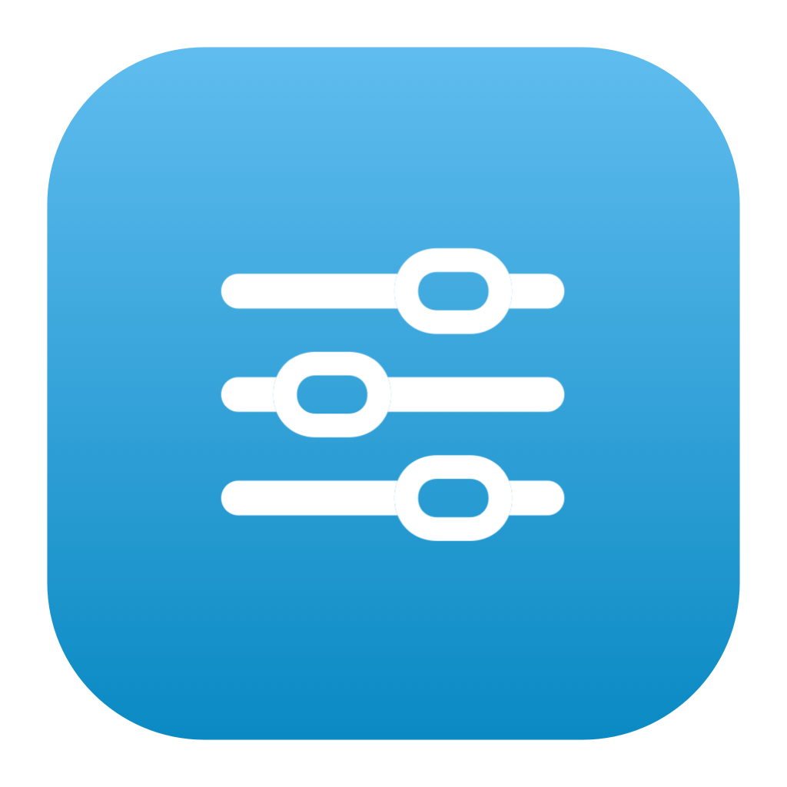
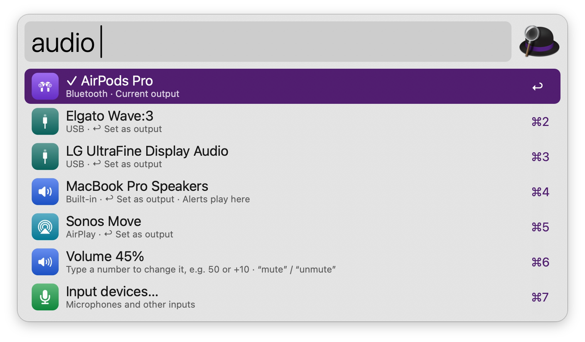
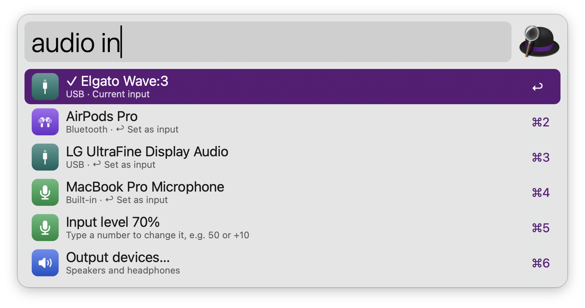
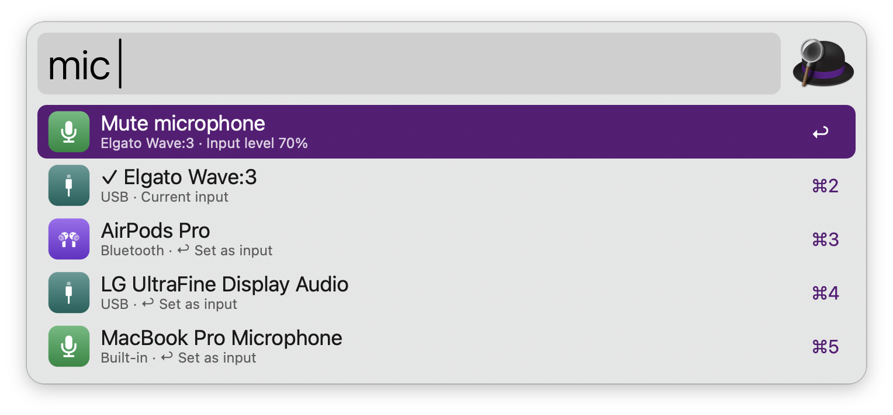
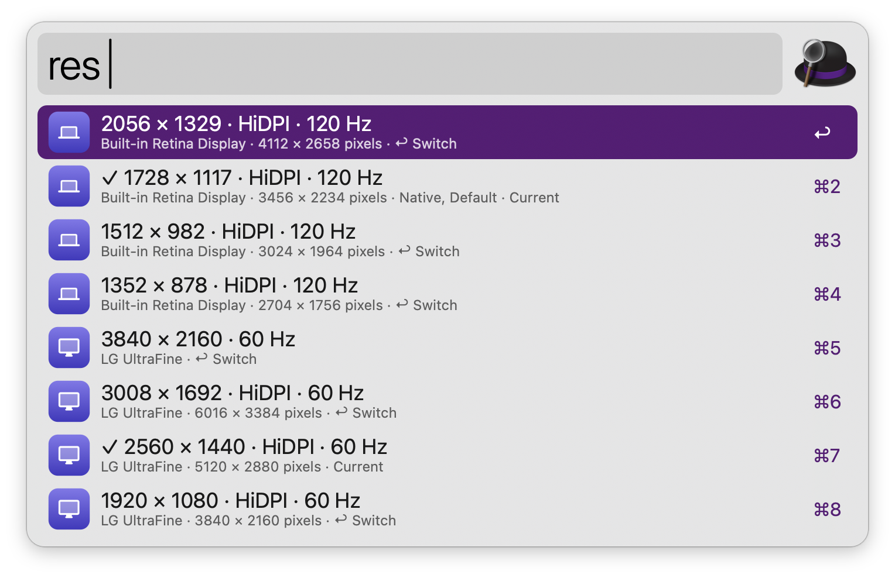
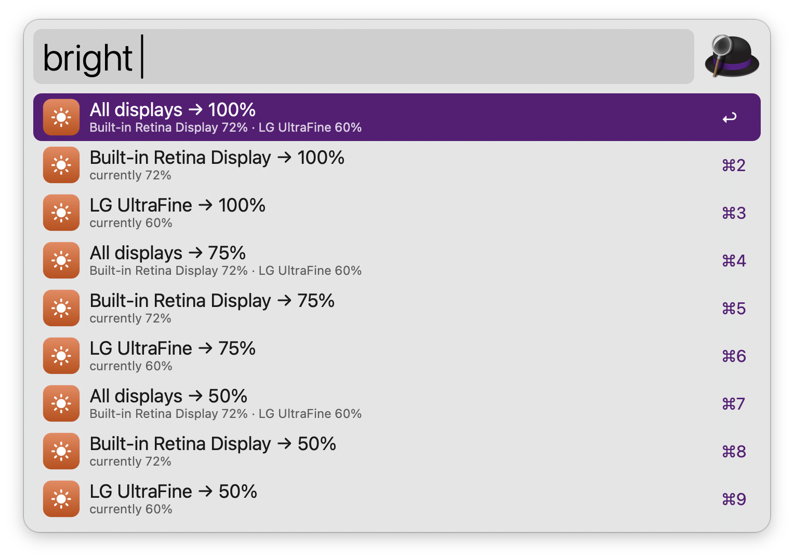
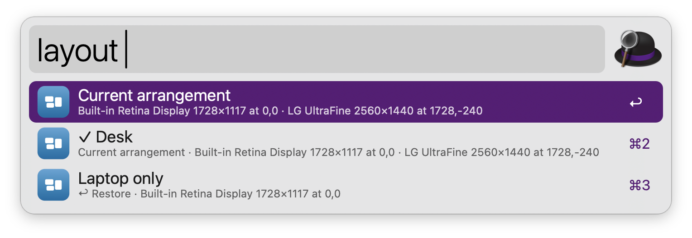
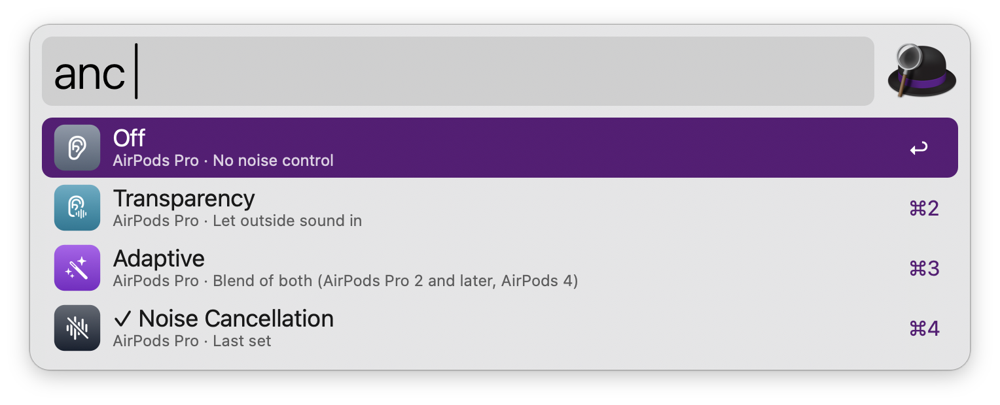

#  Display & Audio Control

Switch audio devices, mute the microphone, change the resolution and brightness of your displays, save and restore display arrangements, and change the AirPods listening mode. Everything runs on tools that ship with macOS; a couple of optional command-line tools add brightness and arrangements for external displays.

## Setup

The AirPods listening mode is changed through the Sound menu of Control Center, so Alfred needs Accessibility permission (System Settings › Privacy & Security › Accessibility). It works best with Sound shown in the menu bar (System Settings › Control Center › Sound › Always Show).

## Usage

Switch the sound output via the `audio` keyword. The current device is marked with ✓, and devices with the same name are numbered. Type a number to set the volume, like `audio 50`, a step like `audio +10` or `audio -10`, or `mute` / `unmute`.



* <kbd>↩</kbd> Set as the output.
* <kbd>⌘</kbd><kbd>↩</kbd> Set as the output and for alerts and sound effects.

Type `in` after the keyword to list input devices instead, like `audio in`, or `audio in 70` / `audio in +10` to set the input level.



### Microphone

Mute or unmute the microphone via the `mic` keyword. Muting remembers the input level, and unmuting restores it; microphones without an adjustable level are muted with their own mute switch. Type a number to set the input level, like `mic 70`, or a step like `mic +10`. Below the toggle are the input devices, to switch microphones.



Configure the Hotkey to mute and unmute from anywhere, with a notification.

### Resolution

Switch the display mode via the `res` keyword. Modes are grouped per display, with the current one marked ✓ and HiDPI (Retina) modes labelled. Type a width, `hidpi`, a refresh rate like `60hz`, or part of a display’s name to filter.



### Brightness

Set the brightness via the `bright` keyword: pick 0, 25, 50, 75 or 100%, type a number like `bright 60`, or adjust with `+10` / `-10`. With several displays, set them all at once or one by one.



Built-in and Apple displays work out of the box. Other external displays need [BetterDisplay](https://github.com/waydabber/BetterDisplay) (running) or [m1ddc](https://github.com/waydabber/m1ddc) (Apple silicon).

### Arrangements

Save the current display arrangement via the `layout` keyword followed by `save` and a name, like `layout save Desk`. It remembers where each display sits, its resolution and mirroring. Type the keyword alone to see saved arrangements, with ✓ on the one in use.



* <kbd>↩</kbd> Restore the arrangement.
* <kbd>⌥</kbd><kbd>↩</kbd> Delete it.

When [displayplacer](https://github.com/jakehilborn/displayplacer) is installed, arrangements are also saved and restored with it, which adds rotation and colour depth.

### AirPods

Change the listening mode of your AirPods or Beats via the `anc` keyword: Noise Cancellation, Transparency, Adaptive or Off. The headphones must be the current output. It works in every language macOS supports.



Configure the Hotkey to switch between two modes set in the Workflow’s Configuration.

Every keyword can be changed in the Workflow’s Configuration.

## Development

```bash
swift tools/make_icons.swift tools/icons.json src   # regenerate icons
python3 tools/build.py --package                     # write src/info.plist and dist/*.alfredworkflow
python3 tests/test_display_audio.py                  # run the tests (never changes real settings)
```

Setters honour `DA_DRY_RUN=1`, which prints the call they would make instead of making it:

```bash
cd src && DA_DRY_RUN=1 osascript -l JavaScript displayaudio.js act '{"op":"volume","scope":"output","value":30}'
```

## AI disclosure

This workflow was developed with the help of Claude (Anthropic), an AI assistant. The code is reviewed and tested by the author.
